Analysis of Friends of Casco Bay DIN Data
================
Curtis C. Bohlen, Casco Bay Estuary Partnership.
04/26/2021

-   [Introduction](#introduction)
-   [Load Data](#load-data)
    -   [Folder References](#folder-references)
    -   [Load Data](#load-data-1)
-   [Station Names](#station-names)
-   [Data Review](#data-review)
    -   [Data Prevalence](#data-prevalence)
    -   [Data Distributions](#data-distributions)
    -   [Cross- Plot DIN by TN](#cross--plot-din-by-tn)
    -   [Add Shortened Site Names](#add-shortened-site-names)
-   [Extract Recent Results](#extract-recent-results)
    -   [Sample Frequencies](#sample-frequencies)
-   [Models](#models)
-   [Recent Data](#recent-data)
    -   [Linear Model](#linear-model)
        -   [Model Diagnostics](#model-diagnostics)
        -   [Marginal Means](#marginal-means)
    -   [Simplified Linear Models](#simplified-linear-models)
        -   [Compare to Observed Means](#compare-to-observed-means)
    -   [GAM Model](#gam-model)
        -   [Compare to Observed Mean](#compare-to-observed-mean)
    -   [Sample Sizes are Wildly
        Unequal](#sample-sizes-are-wildly-unequal)
-   [Restricted DIN Data (Year = 2019)](#restricted-din-data-year--2019)
    -   [Calculate Descriptive
        Statistics](#calculate-descriptive-statistics)
    -   [Linear Model](#linear-model-1)
    -   [Simplified Linear Model](#simplified-linear-model)
    -   [Robust Linear Model](#robust-linear-model)
    -   [GAM model](#gam-model-1)
        -   [Compare Model Results – Does Model Selection
            Matter?](#compare-model-results--does-model-selection-matter)
        -   [DIN Recent Condition
            Conclusions](#din-recent-condition-conclusions)
-   [Trend Analysis](#trend-analysis)
    -   [Data Prevalence](#data-prevalence-1)
    -   [Generate Trend Data](#generate-trend-data)


# Introduction

This notebook Looks at DIN and TN numbers from Friends of Casco Bay
samples.

FOCB reports the TN samples and DIN samples were sent to different
laboratories, and so direct comparison relies on consistent calibration,
etc. across two labs. Accordingly, here we restrict our analysis to
looking at the two data sources as complementary views of nitrogen in
Casco Bay.

FOCB also reports that some DIN samples over the years had unusually
high ammonium values, and that those samples were noted by the
laboratory conducting the analyses, but not flagged as errors. We create
alternate data with select samples removed from Ammonia and DIN values,
but mostly focus on using robust and resistant methods to minimize
impact of those possibly erroneous samples.

A useful discussion of available robust and resistant methods in R is
available on a [CRAN “Task View” for robust
statistics](https://cran.r-project.org/web/views/Robust.html).

-   The `rlm()` and `lqs()` functions from MASS are fairly general,
    using m-estimators and minimization of only a subset of residuals,
    respectively.  
-   The `mblm()` function from `mblm` package offers simple linear
    regression models, but limited flexibility. it does not handle
    categorical variables thoroughly.  
-   The WRS2 package addresses relatively simple ANOVA and ACOVA
    structures with several alternate modeling approaches.  
-   The `walrus` package is built on WRS2, but offers simplified user
    interface and fewer functions. It handles robust ANOVA and T tests.

\#Load Libraries

``` r
library(MASS) # for `rlm()` ans `lqs()`for robust regression
              # also `cov.rob()` for robust multivariate scatter and covariance.
              # Because MASS contains a function `select()` that conflicts with
              # the tidyverse `select()` function, `MASS` should be loaded before
              # the tidyverse.

#library(readr)
library(readxl)
library(tidyverse)
#> Warning: package 'tidyverse' was built under R version 4.0.5
#> -- Attaching packages --------------------------------------- tidyverse 1.3.1 --
#> v ggplot2 3.3.3     v purrr   0.3.4
#> v tibble  3.1.2     v dplyr   1.0.6
#> v tidyr   1.1.3     v stringr 1.4.0
#> v readr   1.4.0     v forcats 0.5.1
#> Warning: package 'tidyr' was built under R version 4.0.5
#> Warning: package 'dplyr' was built under R version 4.0.5
#> Warning: package 'forcats' was built under R version 4.0.5
#> -- Conflicts ------------------------------------------ tidyverse_conflicts() --
#> x dplyr::filter() masks stats::filter()
#> x dplyr::lag()    masks stats::lag()
#> x dplyr::select() masks MASS::select()

library(mgcv)    # For generalized linear models
#> Loading required package: nlme
#> 
#> Attaching package: 'nlme'
#> The following object is masked from 'package:dplyr':
#> 
#>     collapse
#> This is mgcv 1.8-36. For overview type 'help("mgcv-package")'.
#library(mblm)     # for median-based linear\models -- suitable for simple robust methods.
library(emmeans)
library(moments)  # for skewness and kurtosis)

library(sfsmisc)  # Provides alternative access to wald test for robust models
#> Warning: package 'sfsmisc' was built under R version 4.0.5
#> 
#> Attaching package: 'sfsmisc'
#> The following object is masked from 'package:dplyr':
#> 
#>     last

#library(Ternary) # Base graphics ternary plots

library(CBEPgraphics)
load_cbep_fonts()
theme_set(theme_cbep())
```

# Load Data

## Folder References

``` r
sibfldnm <- 'Derived_Data'
parent <- dirname(getwd())
sibling <- file.path(parent,sibfldnm)

dir.create(file.path(getwd(), 'figures'), showWarnings = FALSE)
```

## Load Data

The data we use her has had a number of suspiciously high NH4 values
removed. See “FOCB\_Nutrients\_Combined.Rmd” for details and
explanation/

``` r
strict_data <- read_csv(file.path(sibling, 
                                 "focb_n_data_strict.csv"))%>%
  mutate(month = factor(month, levels = month.abb),
         yearf = factor(year))
#> 
#> -- Column specification --------------------------------------------------------
#> cols(
#>   station = col_character(),
#>   dt = col_datetime(format = ""),
#>   year = col_double(),
#>   yearf = col_double(),
#>   month = col_character(),
#>   doy = col_double(),
#>   tn_depth = col_double(),
#>   din_depth = col_double(),
#>   tn = col_double(),
#>   nox = col_double(),
#>   nh4 = col_double(),
#>   din = col_double(),
#>   din_N = col_double(),
#>   nox_N = col_double(),
#>   nh4_N = col_double(),
#>   organic_N = col_double()
#> )
```

# Station Names

``` r
fn <- 'FOCB Monitoring Sites SHORT NAMES.xlsx'
names_df <- read_excel(file.path(sibling, fn))
```

# Data Review

## Data Prevalence

``` r
xtabs(~station + year, data = strict_data[! is.na(strict_data$din),])
#>        year
#> station 2001 2002 2003 2004 2005 2006 2007 2008 2009 2010 2011 2012 2013 2014
#>   BMR02    0    0    0    0    7    4    5    2    3    8    0    0    0    0
#>   CMS1     0    0    0    0    0    0    0    0   14   19    0    0    0    0
#>   EEB18    0    0    0    0   15   17    2   10   24   19    2    1    0    0
#>   HR1      0    0    0    0    0    0    0    0    0    0    0    0    0    0
#>   HR2      0    0    0    0   20   12   15   10   20   19    0    0    0    0
#>   HR3      0    0    0    0    0    0    0    0    0    0    0    0    0    0
#>   HR4      0    0    0    0    0    0    0    0    0    3    2    2    0    0
#>   KVL84    0    0    0    0    0    0   39   28   22   15    2    2    0    0
#>   MPL86    0    0    0    0    0    0    0    0    0    0    0    0    0    0
#>   NMM79   35   13    0    0   13    6   20   17   17   27    2    5    0    0
#>   OBY35    0    0    0    0    0    0   20   16   20   14    0    0    0    0
#>   P5BSD    3   11   14   13   14   15   10   11    8    8   10    7   12    8
#>   P6FGG   10   12   13   13   12   16   12   11    8    8   10    7   12    7
#>   P7CBI    3    5   12   13   14   14   12   11    7    9   10   10   12    7
#>   PH1      0    0    0    0    0    0    0    0    0    0    0    0    0    0
#>   PH2      0    0    0    0    0    0    0    0    0    0    0    0    0    0
#>   PH3      0    0    0    0    0    0    0    0    0    0    0    0    0    0
#>   PKT42   11    6    9   10   12    8   10    8    4    5    6    6    8    4
#>   PRV70    0    0    0    0    0    0   21   24   12   13    2    2    0    0
#>   PYC43    0    0    0    0   17   20   18   11   10   20    0    0    0    0
#>   RRC46    0    0    0    0   17    4   16    7    8   15    0    0    0    0
#>   RRY47    0    0    0    0   18   16   14   17   17   23    2    2    0    0
#>   SMT50   95  102  139  132   92   82  115   84   48   61   32   10   23    8
#>   STR54    0    0    0    0   13   14    9   12    5   18    2    2    0    0
#>        year
#> station 2015 2016 2017 2019
#>   BMR02    0    0    0    8
#>   CMS1     0    0    2    8
#>   EEB18    0    0    2    8
#>   HR1      0    0    3    8
#>   HR2      0    0    4    3
#>   HR3      0    0    3    3
#>   HR4      0    0    0    7
#>   KVL84    0    0    1    0
#>   MPL86    0    0    0    8
#>   NMM79    0    0    1    7
#>   OBY35    0    0    0    7
#>   P5BSD    7   16    1    8
#>   P6FGG    8   14    1    8
#>   P7CBI    8   11    0    7
#>   PH1      0    0    1    8
#>   PH2      0    0    1    8
#>   PH3      0    0    1    7
#>   PKT42    4    1    2    8
#>   PRV70    0    0    0    7
#>   PYC43    0    0    1    7
#>   RRC46    0    0    0    8
#>   RRY47    0    0    2    8
#>   SMT50   25   45    0    8
#>   STR54    0    0    0    8
```

DIN data has been collected fairly consistently from a handful of sites
over many years, and from many sites only in 2019.

## Data Distributions

``` r
ggplot(strict_data , aes(din)) +
  geom_histogram()
#> `stat_bin()` using `bins = 30`. Pick better value with `binwidth`.
#> Warning: Removed 419 rows containing non-finite values (stat_bin).
```

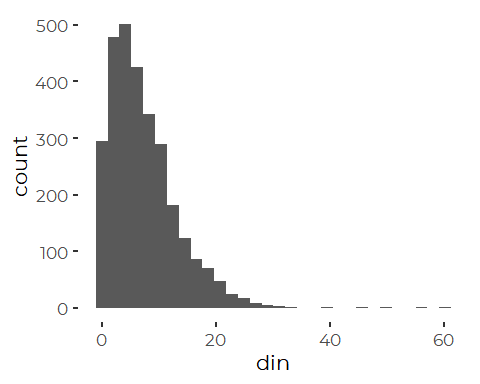

A log transform is “too stong” for DIN and leaves us skewed the other
way.

``` r
ggplot(strict_data , aes(din)) +
  geom_histogram(aes(fill = station)) +
  theme(legend.position = 'none') +
  scale_x_log10()
#> Warning: Transformation introduced infinite values in continuous x-axis
#> `stat_bin()` using `bins = 30`. Pick better value with `binwidth`.
#> Warning: Removed 430 rows containing non-finite values (stat_bin).
```

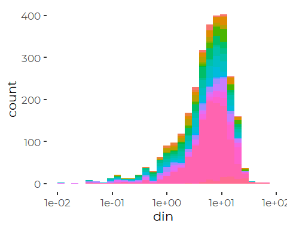

So data is distributed somewhere between normal and lognormal in terms
of skewness. But that skew could be due to data distributions,
inappropriate transforms, or differences in sampling frequency among
stations or years.

We can partially correct by using a generalized log transform, although
selection of the addative constant is fairly arbitrary.

(but not this assessmsnt changes with some data subsets, below).

``` r
ggplot(strict_data , aes(log1p(din))) +
  geom_histogram(aes(fill = station)) +
  theme(legend.position = 'none')
#> `stat_bin()` using `bins = 30`. Pick better value with `binwidth`.
#> Warning: Removed 419 rows containing non-finite values (stat_bin).
```

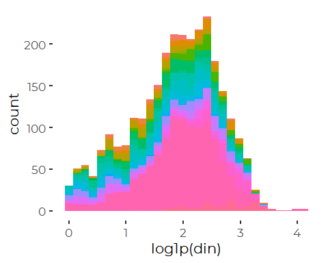

But the log plus one transform looks pretty good for most stations.

``` r
ggplot(strict_data , aes(log1p(din + 1))) +
  geom_density(aes(fill = station)) +
  facet_wrap(~ station) +
  theme_minimal() +         # restores gridlines
  theme(legend.position = 'none')
#> Warning: Removed 419 rows containing non-finite values (stat_density).
```

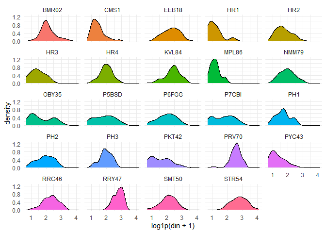
A number of sites show tendencies towards bimodal distributions of DIN.
Later analyses suggest that may reflect seasonal patterns.

## Cross- Plot DIN by TN

``` r
ggplot(strict_data, aes(tn, din_N)) + 
  geom_point(aes(fill = month), size = 2, shape = 21, alpha = 0.5) +
  geom_abline(intercept = 0, slope = 1) +
  #scale_fill_manual(values = cbep_colors()) +
  coord_equal() +
  theme_cbep(base_size = 12) +
    ylab('DIN (mg/ l as N)') +
    xlab('TN (mg/l)')
#> Warning: Removed 2657 rows containing missing values (geom_point).
```

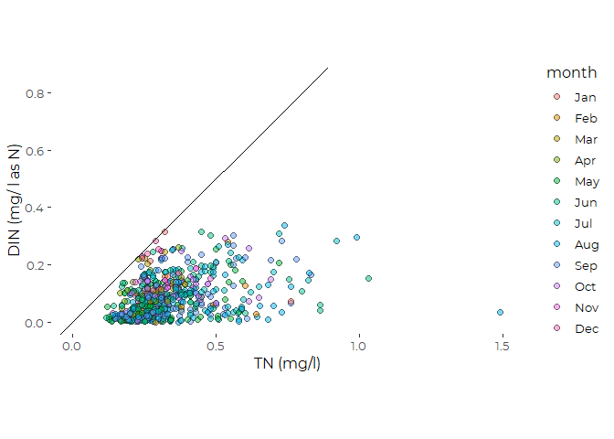
\# Recent Conditions Recent conditions include data from 2015 through
2019.

We remove the data for KVL84 from these analyses, because we have very
limited local data from that site.

``` r
recent_data <- strict_data %>%
  filter(year > 2014) %>%
  filter(station != 'KVL84')
```

## Add Shortened Site Names

The key step here is reordering by median nitrogen values. That ordering
will need to be harmonized with TN ordering to generate final graphics.

``` r
recent_data <- recent_data %>%
   mutate(station_name = names_df$Alt_Name[match(station,
                                                names_df$Station_ID)]) %>%
   mutate(station = factor(station),
          station_name = factor(station_name)) %>%
   mutate(station = fct_reorder(station, tn, na.rm = TRUE),
         station_name = fct_reorder(station_name, tn, na.rm = TRUE)) %>%
   relocate(station_name, .after = station) %>%
   select(-tn_depth, -tn, -organic_N)
```

# Extract Recent Results

This is the simplest analysis, with no hierarchical modeling. We drop
the extreme TN values, ass we do for most analyses coming up.

``` r
recent_results <- recent_data %>%
  group_by(station) %>%
  summarize(across(nox:nh4_N, c(mn = ~ mean(.x, na.rm = TRUE),
                                  sd = ~ sd(.x, na.rm = TRUE), 
                                  n = ~sum(! is.na(.x)),
                                  md = ~ median(.x, na.rm = TRUE),
                                  iqr = ~ IQR(.x, na.rm = TRUE),
                                  p90 = ~ quantile(.x, .9, na.rm = TRUE),
                                  gm = ~ exp(mean(log(.x), na.rm = TRUE))))) %>%
  mutate(station_name = names_df$Alt_Name[match(station,
                                                names_df$Station_ID)]) %>%
  mutate(station = fct_reorder(factor(station), din_md),
         station_name = fct_reorder(factor(station_name), din_md)) %>%
  relocate(station_name, .after = station)
```

## Sample Frequencies

``` r
recent_results %>%
  select(station, contains('_N_n') )
#> # A tibble: 23 x 4
#>    station din_N_n nox_N_n nh4_N_n
#>    <fct>     <int>   <int>   <int>
#>  1 CMS1         10      17      10
#>  2 OBY35         7      12       7
#>  3 PYC43         8      14       8
#>  4 P7CBI        26      40      27
#>  5 P5BSD        32      42      32
#>  6 PH1           9      16       9
#>  7 HR1          11      18      11
#>  8 BMR02         8      15       8
#>  9 HR3           6      13       6
#> 10 PH2           9      15       9
#> # ... with 13 more rows
```

We note that several stations have fewer than ten DIN samples over that
period of time. Only one site (KVL84, Knightville Landing, in South
Portland) has fewer than five DIN values. It and was dropped, above, for
lack of recent data.

TN values are somewhat more abundant, with only a single site with fewer
than ten TN samples.

With the relatively low sample sizes for most sites, complex models may
perform poorly. Interactions with time of year and year, in particular,
will lead to many empty cells in the implicit model design.

# Models

We want to look at recent conditions, taking into account as best we can
possible covariates, including year and time of year. Our goal is to
extract marginal means by station for the recent data, and evaluate
trends for the long-term data.

# Recent Data

## Linear Model

We begin by constructing conventional linear models on log transformed
DIN data.

``` r
full_din_lm <- lm(log(din_N) ~ station *  month + yearf, data = recent_data)
anova(full_din_lm)
#> Analysis of Variance Table
#> 
#> Response: log(din_N)
#>                Df  Sum Sq Mean Sq F value    Pr(>F)    
#> station        22 149.320  6.7873  7.8165 < 2.2e-16 ***
#> month          11  85.155  7.7413  8.9153 1.685e-12 ***
#> yearf           3  28.829  9.6098 11.0671 1.098e-06 ***
#> station:month 120  80.095  0.6675  0.7687    0.9382    
#> Residuals     174 151.088  0.8683                      
#> ---
#> Signif. codes:  0 '***' 0.001 '**' 0.01 '*' 0.05 '.' 0.1 ' ' 1
```

Stepwise model selection confirms that the interaction term is of little
value (by AIC; not shown) .

``` r
din_lm <- lm(log(din_N) ~ station +  month + yearf, data = recent_data)
anova(din_lm)
#> Analysis of Variance Table
#> 
#> Response: log(din_N)
#>            Df  Sum Sq Mean Sq F value    Pr(>F)    
#> station    22 149.320  6.7873  8.6315 < 2.2e-16 ***
#> month      11  85.155  7.7413  9.8448 3.323e-15 ***
#> yearf       3  28.829  9.6098 12.2210 1.473e-07 ***
#> Residuals 294 231.183  0.7863                      
#> ---
#> Signif. codes:  0 '***' 0.001 '**' 0.01 '*' 0.05 '.' 0.1 ' ' 1
```

### Model Diagnostics

``` r
oldpar <- par(mfrow = c(2,2))
plot(din_lm)
```

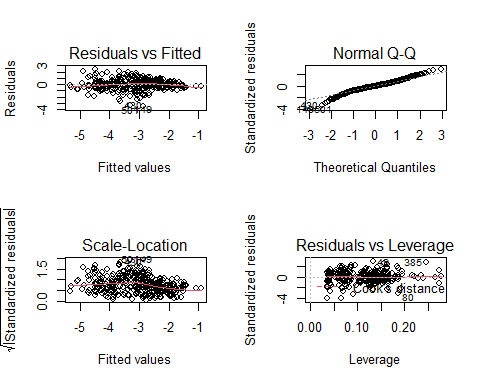

``` r
par(oldpar)
```

We have a few values that are fairly badly underestimated (large
negative residuals), but this is not dreadful. Residuals are somewhat
heavy tailed.

``` r
recent_data[c(149, 430, 501),]
#> # A tibble: 3 x 14
#>   station station_name     dt                   year yearf month   doy din_depth
#>   <fct>   <fct>            <dttm>              <dbl> <fct> <fct> <dbl>     <dbl>
#> 1 P5BSD   Broad Sound      2016-08-16 00:00:00  2016 2016  Aug     229       0.2
#> 2 P7CBI   Clapboard Island 2015-05-27 00:00:00  2015 2015  May     147       0.2
#> 3 SMT50   SMCC Pier        2016-07-25 00:00:00  2016 2016  Jul     207       0.2
#> # ... with 6 more variables: nox <dbl>, nh4 <dbl>, din <dbl>, din_N <dbl>,
#> #   nox_N <dbl>, nh4_N <dbl>
```

The poorly fit samples are all from 2015 and 2016, warm season. It is
possible the fit for those years is affected by the prevalence of winter
samples, with the unbalanced sampling history biasing estimates.

### Marginal Means

``` r
din_emms_lm <- emmeans(din_lm, 'station', type = 'response')
din_emms_lm_jul <- emmeans(din_lm, 'station', type = 'response', 
                       at = list(month = 'Jul'))

plot(din_emms_lm) + coord_flip() + 
  theme(axis.text.x = element_text(angle = 90, vjust = 0.25))
```

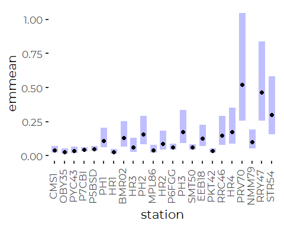
\#\#\# Compare to Obsereved Means Unfortunately, this model does a
fairly poor job regenerating the means from the original data, and
standard errors for some estimates are very large (note the log-log
plot). This suggests this model is performing poorly.

``` r
compare <- recent_results %>%
  select(station, station_name, contains('tn'), contains('din_N')) %>%
  full_join(din_emms_lm, by = 'station', suffix = c('.data', '.lm'), copy = TRUE)

ggplot(compare, aes(din_N_mn, response)) +
  geom_abline(slope = 1, intercept = 0) + 
  geom_point(size = 3, color = 'blue') +
  geom_linerange(aes(xmin = din_N_mn - 2 * din_N_sd/sqrt(din_N_n), 
                     xmax = din_N_mn + 2 * din_N_sd/sqrt(din_N_n))) +
  geom_linerange(aes(ymin = lower.CL, ymax = upper.CL)) +
  xlab('Observed ') +
  ylab('Log Linear Model') +
  coord_equal() +
  scale_x_log10() +
  scale_y_log10()
#> Warning in self$trans$transform(x): NaNs produced
#> Warning: Transformation introduced infinite values in continuous x-axis
#> Warning: Removed 2 rows containing missing values (geom_segment).
```

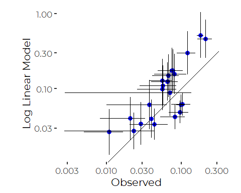

## Simplified Linear Models

We look at a linear models that do not include as many predictors, and
show that they return marginal means that DO match the observed means
fairly well.

``` r
red_din_lm  <- lm(log(din_N) ~ station, data = recent_data)
din_emms_red_lm     <- emmeans(red_din_lm,     'station', type = 'response')
```

### Compare to Observed Means

``` r
compare <- recent_results %>%
  select(station, station_name, contains('tn'), contains('din_N')) %>%
  full_join(din_emms_red_lm, by = 'station', suffix = c('.data', '.lm'), copy = TRUE)

ggplot(compare, aes(din_N_mn, response)) +
  geom_abline(slope = 1, intercept = 0) + 
  geom_point(size = 3, color = 'blue') +
  geom_linerange(aes(xmin = din_N_mn - 2 * din_N_sd/sqrt(din_N_n), 
                     xmax = din_N_mn + 2 * din_N_sd/sqrt(din_N_n))) +
  geom_linerange(aes(ymin = lower.CL, ymax = upper.CL)) +
  xlab('Observed ') +
  ylab('Linear Model') +
  coord_equal() +
  scale_x_log10() +
  scale_y_log10()
#> Warning in self$trans$transform(x): NaNs produced
#> Warning: Transformation introduced infinite values in continuous x-axis
#> Warning: Removed 2 rows containing missing values (geom_segment).
```

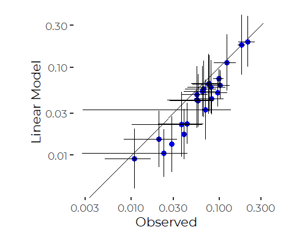
Standard errors are still fairly large, but the model at least provides
results closer to observed means. Error bars tend to overlap the 1:1
line. The differences here probably reflect the differences between
geometric and arithmetic means.

All this suggests we are slicing these data too finely, and we should
take a different approach. We have good data coverage from 2019, so we
can restrict attention to 2019.

## GAM Model

We can use a GAM model to look more closely at seasonal patterns.

``` r
din_gam <- gam(log(din_N) ~ station +  s(doy, bs = 'cc', k = 5) + 
                                         s(yearf, bs = 're'), 
               data = recent_data)
anova(din_gam)
#> 
#> Family: gaussian 
#> Link function: identity 
#> 
#> Formula:
#> log(din_N) ~ station + s(doy, bs = "cc", k = 5) + s(yearf, bs = "re")
#> 
#> Parametric Terms:
#>         df     F p-value
#> station 22 7.732  <2e-16
#> 
#> Approximate significance of smooth terms:
#>            edf Ref.df     F  p-value
#> s(doy)   2.793  3.000 17.06 6.68e-07
#> s(yearf) 2.784  3.000 12.89  < 2e-16
```

``` r
plot(din_gam)
```

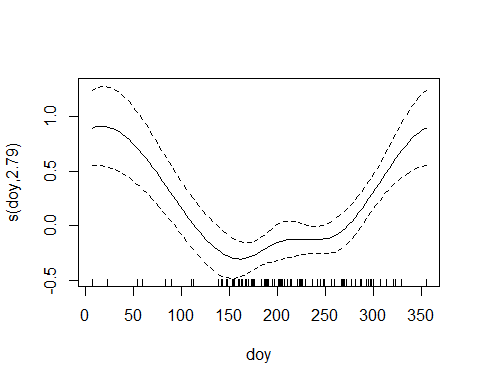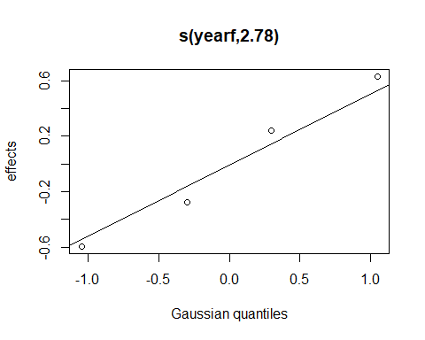
The day of year smoother may be slightly over fit here, and we have not
fully explored interactions between seasonal effects and station.

``` r
oldpar <- par(mfrow = c(2,2))
gam.check(din_gam)
```


    #> 
    #> Method: GCV   Optimizer: magic
    #> Smoothing parameter selection converged after 12 iterations.
    #> The RMS GCV score gradient at convergence was 6.894554e-07 .
    #> The Hessian was positive definite.
    #> Model rank =  30 / 30 
    #> 
    #> Basis dimension (k) checking results. Low p-value (k-index<1) may
    #> indicate that k is too low, especially if edf is close to k'.
    #> 
    #>            k'  edf k-index p-value  
    #> s(doy)   3.00 2.79    0.91   0.035 *
    #> s(yearf) 4.00 2.78      NA      NA  
    #> ---
    #> Signif. codes:  0 '***' 0.001 '**' 0.01 '*' 0.05 '.' 0.1 ' ' 1
    par(oldpar)

Those diagnostics are not too bad, with the exception of large negative
residuals again.

#### GAM Marginal Means

``` r
din_emms_gam <- emmeans(din_gam, 'station', type = 'response', 
                        cov_reduce = median,
                        cov_keep = 'year',
                        at = list(doy = 200))
plot(din_emms_gam) + coord_flip() + 
  theme(axis.text.x = element_text(angle = 90, vjust = 0.25))
```

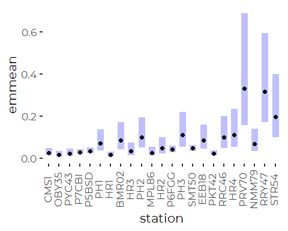

``` r
din_emms_gam <- as_tibble(din_emms_gam)
```

### Compare to Observed Mean

``` r
compare <- recent_results %>%
  select(station, station_name, contains('tn'), contains('din_N')) %>%
  full_join(din_emms_gam, by = 'station', suffix = c('.data', '.lm'), copy = TRUE)

ggplot(compare, aes(din_N_mn, response)) +
  geom_abline(slope = 1, intercept = 0) + 
  geom_point(size = 3, color = 'blue') +
  geom_linerange(aes(xmin = din_N_mn - 2 * din_N_sd/sqrt(din_N_n), 
                     xmax = din_N_mn + 2 * din_N_sd/sqrt(din_N_n))) +
  geom_linerange(aes(ymin = lower.CL, ymax = upper.CL)) +
  xlab('Observed ') +
  ylab('Log Linear Model') +
  coord_equal() +
  scale_x_log10() +
  scale_y_log10()
#> Warning in self$trans$transform(x): NaNs produced
#> Warning: Transformation introduced infinite values in continuous x-axis
#> Warning: Removed 2 rows containing missing values (geom_segment).
```

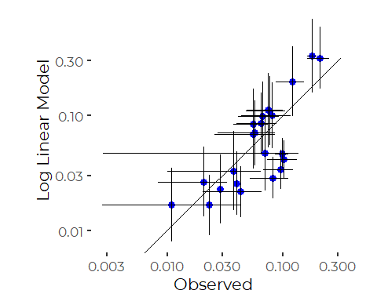

This does better than the linear model, but only slightly

## Sample Sizes are Wildly Unequal

Sample sizes are wildly unequal….

``` r
xtabs(~ year + month, data = recent_data , subset = ! is.na(din))
#>       month
#> year   Jan Feb Mar Apr May Jun Jul Aug Sep Oct Nov Dec
#>   2015   5   0   5   1   2  13   7   6   6   3   4   0
#>   2016   5   4   2   4   4   9   9   8   8  14  14   6
#>   2017   0   0   1   0   0   0   3  10   5   6   0   0
#>   2019   0   0   0   0  21  21  39  23  45  18   0   0
```

So, seasonal trnds outside of summer rest on just a handful of
observations in each of 2015 and 2016.

``` r
xtabs(~ station + year, data = recent_data , subset = ! is.na(din))
#>        year
#> station 2015 2016 2017 2019
#>   CMS1     0    0    2    8
#>   OBY35    0    0    0    7
#>   PYC43    0    0    1    7
#>   P7CBI    8   11    0    7
#>   P5BSD    7   16    1    8
#>   PH1      0    0    1    8
#>   HR1      0    0    3    8
#>   BMR02    0    0    0    8
#>   HR3      0    0    3    3
#>   PH2      0    0    1    8
#>   MPL86    0    0    0    8
#>   HR2      0    0    4    3
#>   P6FGG    8   14    1    8
#>   PH3      0    0    1    7
#>   SMT50   25   45    0    8
#>   EEB18    0    0    2    8
#>   PKT42    4    1    2    8
#>   RRC46    0    0    0    8
#>   HR4      0    0    0    7
#>   PRV70    0    0    0    7
#>   NMM79    0    0    1    7
#>   RRY47    0    0    2    8
#>   STR54    0    0    0    8
```

And those observations come from just a handful of sites.

The problem here is the uneven sampling history. We are trying to
overinterpret available data, leading to statistically unstable
estimates.

# Restricted DIN Data (Year = 2019)

Our primary goal is to provide a map and accompanying chart of DIN
levels. For that, we want to compare all sites on an even footing. We
now know that there are important annual and seasonal processes at work,
so the uneven sampling history affects estimates of site conditions.

Data coverage in 2019 is fairly consistent. Coverage is sparse, but
consistent across stations (but not months) in 2017 as well.

We restrict further attention to just 2019, as that data will not be
affected by the uneven sampling history to the same extent.

``` r
yr_2019_data <- recent_data %>%
  filter(year == 2019)  %>%
  select(station, station_name, dt, month, doy, din_N)
```

``` r
ggplot(yr_2019_data, aes(din_N)) +
  geom_histogram() +
  scale_x_continuous(trans = 'log')
#> `stat_bin()` using `bins = 30`. Pick better value with `binwidth`.
#> Warning: Removed 22 rows containing non-finite values (stat_bin).
```

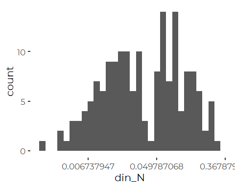

``` r
ggplot(yr_2019_data, aes(din_N, station_name)) +
  geom_point(aes(color = month)) +
  scale_x_log10()
#> Warning: Removed 22 rows containing missing values (geom_point).
```

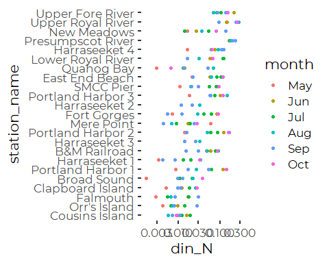

### Calculate Descriptive Statistics

``` r
results_2019 <- yr_2019_data %>%
  group_by(station) %>%
  summarize(across(din_N, c(mn = ~ mean(.x, na.rm = TRUE),
                                  sd = ~ sd(.x, na.rm = TRUE), 
                                  n = ~sum(! is.na(.x)),
                                  md = ~ median(.x, na.rm = TRUE),
                                  iqr = ~ IQR(.x, na.rm = TRUE),
                                  p90 = ~ quantile(.x, .9, na.rm = TRUE),
                                  gm = ~ exp(mean(log(.x), na.rm = TRUE))))) %>%
  mutate(station_name = names_df$Alt_Name[match(station,
                                                names_df$Station_ID)]) %>%
  mutate(station = fct_reorder(factor(station), din_N_md),
         station_name = fct_reorder(factor(station_name), din_N_md)) %>%
  relocate(station_name, .after = station)
```

### Linear Model

``` r
din_lm_2019_draft <- lm(log(din_N) ~ station *  month , data = yr_2019_data)
anova(din_lm_2019_draft)
#> Analysis of Variance Table
#> 
#> Response: log(din_N)
#>               Df  Sum Sq Mean Sq F value    Pr(>F)    
#> station       22 136.993  6.2270 17.0635 5.400e-14 ***
#> month          5  24.702  4.9403 13.5378 9.567e-08 ***
#> station:month 99  43.575  0.4402  1.2061    0.2555    
#> Residuals     40  14.597  0.3649                      
#> ---
#> Signif. codes:  0 '***' 0.001 '**' 0.01 '*' 0.05 '.' 0.1 ' ' 1
```

``` r
din_lm_2019 <- lm(log(din_N) ~ station + month , data = yr_2019_data)
anova(din_lm_2019)
#> Analysis of Variance Table
#> 
#> Response: log(din_N)
#>            Df  Sum Sq Mean Sq F value    Pr(>F)    
#> station    22 136.993  6.2270  14.879 < 2.2e-16 ***
#> month       5  24.702  4.9403  11.805 1.591e-09 ***
#> Residuals 139  58.172  0.4185                      
#> ---
#> Signif. codes:  0 '***' 0.001 '**' 0.01 '*' 0.05 '.' 0.1 ' ' 1
```

#### Marginal Means

``` r
din_emms_lm_2019 <- emmeans(din_lm_2019, 'station', type = 'response')
plot(din_emms_lm_2019) + coord_flip()+ 
  theme(axis.text.x = element_text(angle = 90, vjust = 0.25))
```

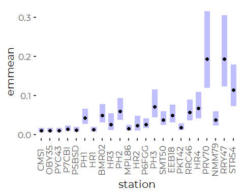

``` r
din_emms_lm_2019_months <- emmeans(din_lm_2019, 'month', type = 'response')
plot(din_emms_lm_2019_months) + coord_flip()+ 
  theme(axis.text.x = element_text(angle = 90, vjust = 0.25))
```

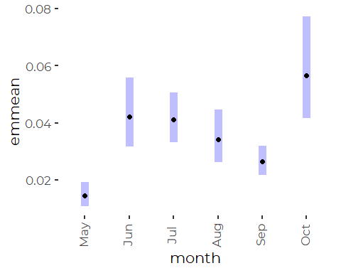

### Simplified Linear Model

``` r
din_lm_2019_red <- lm(log(din_N) ~ station  , data = yr_2019_data)
anova(din_lm_2019_red)
#> Analysis of Variance Table
#> 
#> Response: log(din_N)
#>            Df  Sum Sq Mean Sq F value    Pr(>F)    
#> station    22 136.993  6.2270   10.82 < 2.2e-16 ***
#> Residuals 144  82.874  0.5755                      
#> ---
#> Signif. codes:  0 '***' 0.001 '**' 0.01 '*' 0.05 '.' 0.1 ' ' 1
```

#### Marginal Means

``` r
din_emms_lm_2019_red <- emmeans(din_lm_2019_red, 'station', type = 'response')
plot(din_emms_lm_2019_red) + coord_flip() +
  theme(axis.text.x = element_text(angle = 90, vjust = 0.25))
```

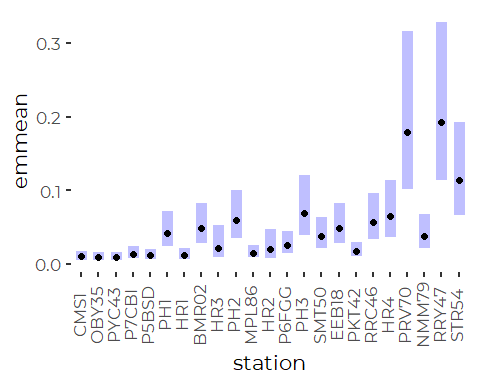
Qualitatively nearly indistinguishable, although stnadard errors are
likely larger.

### Robust Linear Model

Thee `rlm()` function from `MASS` implements robust model fitting using
M estimators. These are estimators that do not use least squares as a
criterion for model fit. Instead, they use other symmetric functions to
quantify the relative importance of the deviation of each observation
from model predictions. To achieve “robust” qualities, these functions
drop off in value at higher deviations from model predictions, making
extreme points count less, or not at all, when fitting the model.

Robust linear models, as implemented via `rlm()` from the `MASS` package
do not accept models not of full rank, which is proven a bit of a
problem for these uneven data sets. We can not fit a station + month
model.

``` r
din_rlm_2019_FAILS <- rlm(log(din_N) ~ station + month, 
                     na.action = na.omit,
                     data = yr_2019_data)
#> Error in rlm.default(x, y, weights, method = method, wt.method = wt.method, : 'x' is singular: singular fits are not implemented in 'rlm'
```

``` r
din_rlm_2019 <- rlm(log(din_N) ~ station, 
                     na.action = na.omit,
                     data = yr_2019_data)
```

#### Marginal Means

``` r
din_emms_lm_2019 <- as_tibble(emmeans(din_lm_2019, 
                                      'station', type = 'response'))
din_emms_rlm_2019 <- as_tibble(emmeans(din_rlm_2019, 
                                      'station', type = 'response'))
```

## GAM model

We can use a GAM model to look at seasonal patterns within this one
year, but this also may be overfitting available data. We don’t fit a
cyclic smoother because our data covers only a small portion of the
year.

``` r
din_gam_2019 <- gam(log(din_N) ~ station +  s(doy, bs = 'cs'), 
               data = yr_2019_data)
anova(din_gam_2019)
#> 
#> Family: gaussian 
#> Link function: identity 
#> 
#> Formula:
#> log(din_N) ~ station + s(doy, bs = "cs")
#> 
#> Parametric Terms:
#>         df     F p-value
#> station 22 14.62  <2e-16
#> 
#> Approximate significance of smooth terms:
#>          edf Ref.df     F p-value
#> s(doy) 5.783  9.000 6.167  <2e-16
```

``` r
plot(din_gam_2019)
```

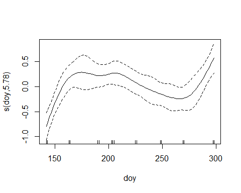
The day of year smoother may be slightly over fit here.

``` r
oldpar <- par(mfrow = c(2,2))
gam.check(din_gam)
```


    #> 
    #> Method: GCV   Optimizer: magic
    #> Smoothing parameter selection converged after 12 iterations.
    #> The RMS GCV score gradient at convergence was 6.894554e-07 .
    #> The Hessian was positive definite.
    #> Model rank =  30 / 30 
    #> 
    #> Basis dimension (k) checking results. Low p-value (k-index<1) may
    #> indicate that k is too low, especially if edf is close to k'.
    #> 
    #>            k'  edf k-index p-value  
    #> s(doy)   3.00 2.79    0.91    0.03 *
    #> s(yearf) 4.00 2.78      NA      NA  
    #> ---
    #> Signif. codes:  0 '***' 0.001 '**' 0.01 '*' 0.05 '.' 0.1 ' ' 1
    par(oldpar)

Those diagnostics are not too bad, with the exception of large negative
residuals again.

#### GAM Marginal Means

``` r
din_emms_gam_2019 <- emmeans(din_gam_2019, 'station', type = 'response')
plot(din_emms_gam_2019) + coord_flip() + 
  theme(axis.text.x = element_text(angle = 90, vjust = 0.25))
```

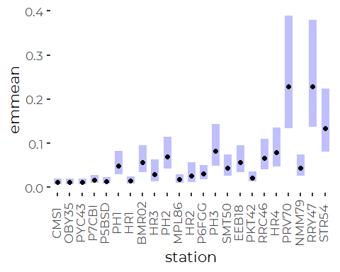

``` r
din_emms_gam_2019 <- as_tibble(din_emms_gam_2019)
```

### Compare Model Results – Does Model Selection Matter?

#### Compare Models to Observed Means

##### Log Linear Model

``` r
compare <- results_2019 %>%
  select(station, station_name, contains('tn'), contains('din_N')) %>%
  full_join(din_emms_lm_2019, by = 'station', suffix = c('.data', '.lm'), 
            copy = TRUE)

ggplot(compare, aes(din_N_mn, response)) +
  geom_abline(slope = 1, intercept = 0) + 
  geom_point(size = 3, color = 'blue') +
  geom_linerange(aes(xmin = din_N_mn - 2 * din_N_sd/sqrt(din_N_n), 
                     xmax = din_N_mn + 2 * din_N_sd/sqrt(din_N_n))) +
  geom_linerange(aes(ymin = lower.CL, ymax = upper.CL)) +
  xlab('Observed ') +
  ylab('Robust Linear Model') +
  coord_equal() +
  scale_x_log10()+
  scale_y_log10()
```

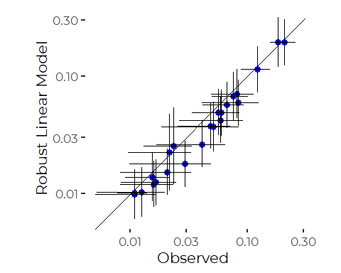
The log linear model generally fits means slightly lower than observed.
This is what is expected as we are effectively fitting geometric means
instead of arithmetic means.

##### Robust Log Linear Model

``` r
compare <- results_2019 %>%
  select(station, station_name, contains('tn'), contains('din_N')) %>%
  full_join(din_emms_rlm_2019, by = 'station', suffix = c('.data', '.lm'), 
            copy = TRUE)

ggplot(compare, aes(din_N_mn, response)) +
  geom_abline(slope = 1, intercept = 0) + 
  geom_point(size = 3, color = 'blue') +
  geom_linerange(aes(xmin = din_N_mn - 2 * din_N_sd/sqrt(din_N_n), 
                     xmax = din_N_mn + 2 * din_N_sd/sqrt(din_N_n))) +
  geom_linerange(aes(ymin = asymp.LCL, ymax = asymp.UCL)) +
  xlab('Observed ') +
  ylab('Robust Linear Model') +
  coord_equal() +
  scale_x_log10()+
  scale_y_log10()
```

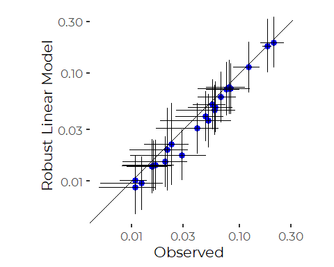
Results of the robust model are very similar.

##### GAM Model

``` r
compare <- results_2019 %>%
  select(station, station_name, contains('tn'), contains('din_N')) %>%
  full_join(din_emms_gam_2019, by = 'station', suffix = c('.data', '.lm'), 
            copy = TRUE)

ggplot(compare, aes(din_N_mn, response)) +
  geom_abline(slope = 1, intercept = 0) + 
  geom_point(size = 3, color = 'blue') +
  geom_linerange(aes(xmin = din_N_mn - 2 * din_N_sd/sqrt(din_N_n), 
                     xmax = din_N_mn + 2 * din_N_sd/sqrt(din_N_n))) +
  geom_linerange(aes(ymin = lower.CL, ymax = upper.CL)) +
  xlab('Observed ') +
  ylab('GAM Model') +
  coord_equal() +
  scale_x_log10()+
  scale_y_log10()
```

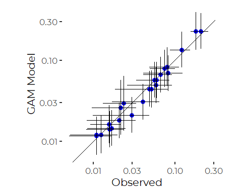

The GAM model provides adjusted estimates that generally lie close to
the observed means. These estimates are effectively adjusted for
different sampling histories. Note that error bars are higher than for
the straight means.

#### Compare Log Linear and Robust Log Linear Models

We can show that more clearly by plotting the predictions of the two
models against one another.

``` r
compare <- as_tibble(din_emms_lm_2019) %>%
  full_join(din_emms_rlm_2019, by = 'station', suffix = c('.lm', '.rlm'))
ggplot(compare, aes(response.lm, response.rlm)) +
  geom_abline(slope = 1, intercept = 0) + 
  geom_point(size = 3, color = 'blue') +
  geom_linerange(aes(xmin = lower.CL, xmax = upper.CL)) +
  geom_linerange(aes(ymin = asymp.LCL, ymax = asymp.UCL)) +
  xlab('Linear Model') +
  ylab('Robust Linear Model') +
  coord_equal() +
  scale_x_log10()+
  scale_y_log10()
```

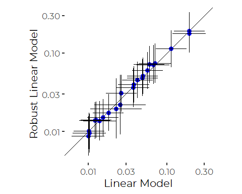
So, results are qualitatively similar. There is no strong reason to
prefer the robust estimates to the linear model estimates where
qualitative results are similar and model diagnostics are fairly good.

### DIN Recent Condition Conclusions

Restricting attention to 2019 makes sense. There appears to be little
advantage to robust models. Even so, there are several approaches
possible:  
1. Just use observed means / medians.  
2. Use fitted means from the simplest linear models. This effectively
fits geometric means, not arithmetic means, and pools error estimates.  
3. Use Marginal Means from the GAM model - -these are effectively
adjusted for different sampling histories.

# Trend Analysis

## Data Prevalence

## Generate Trend Data
